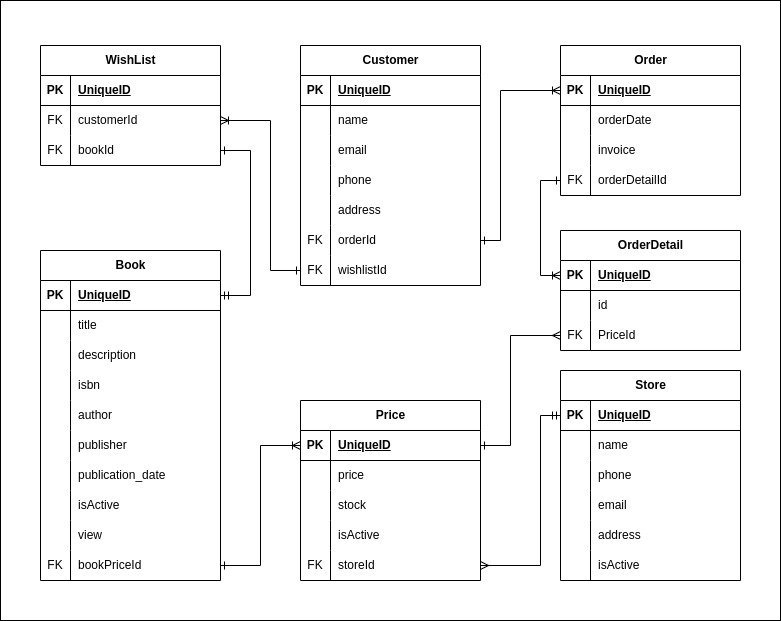

# geramed Online Book Store
Geramed adalah applikasi backend toko buku online. Applikasi ini memiliki 3 role, 
yaitu Admin, Store dan Customer. Setiap role memiliki tugas masing-masing. 
Autentikasi menggunakan jwt.

- [INSTALASI](#instalasi)
- [ERD DIAGRAM](#erd)
- [SERVICE YANG DISEDIAKAN](#fitur)

## INSTALASI
Pertama sekali dilakukan setup server database yang digunakan untuk applikasi ini, 
kita dapat mengaturnya di `application.properties`
```
// Setup username, password dan db pada application.properties
spring.datasource.username=postgres
spring.datasource.password=localhost
spring.datasource.url=jdbc:postgresql://localhost:5432/geramed_db
```

Setelah itu, kita atur email dan password untuk akun admin pertama sekali. 
hal ini kita lakukan karena admin dan store hanya bisa di register oleh admin.
email dan passwordnya kita pasang masih di `application.properties`
```
// email dan password admin
geramed.email=admin@admin.com
geramed.password=admin123
```


> Selain itu kita juga dapat merubah jwt secret kita yang berada pada `application.properties`,
> namun ini bersifat opsional 
> ```
> geramed.jwt-secret=Z2VyYW1lZC1zZWNyZXQta2V5
> geramed.jwt-expiration=3600000
> ```


## ERD
> Pembuatan applikasi ini berpatokan pada ERD dibawah ini


## FITUR
### AUTHENTICATION SERVICE
> NAMA_FITUR_(YANG_MEMILIKI_AKSES)
- Login (Semua)
- Register Admin (Admin)
- Register Store (Admin)
- Register Customer (Semua)

### BOOK SERVICE
- Create Book (Store)
- Create Bulk Book (Store)
- Update Book (Store)
- Delete Book (Store)
- Find All Book (Semua) 
- Find Book by Id (Semua)

### CUSTOMER SERVICE
- Update Customer (Customer)
- Get Customer by Id (Admin)

### ORDER SERVICE
- Create Order (Customer)
- Get Order By Id (Admin)
- Get All Order (Admin)

### Wishlist
- Create (Customer)
- Delete (Customer)
- Find All (Customer) 
